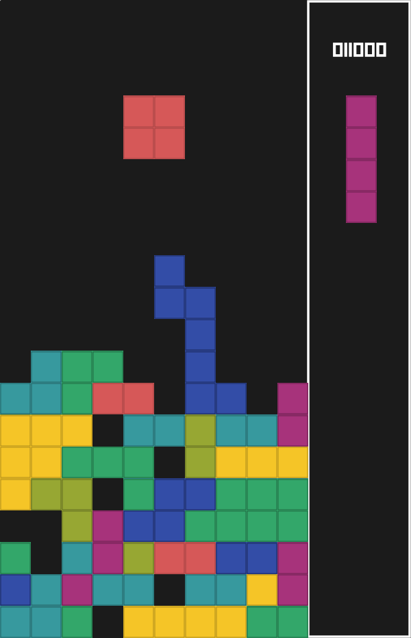

### This is a learning project for amethyst game engine.

Executable binary is in release section. While compilation would also work unless vulkan backend is not accessible. 

If you want to compile by yourself then.

```
git clone https://github.com/Simhyeon/tetrisgame
cd tetrisgame
cargo build --release
cargo run --release
```

### Caution

~~This game is quite buggy. I tried to find some solutions but no success.~~

~~I made this game as a learning project and hardly care about refactor ability of the codes.~~

~~If I need to fix the bugs then I have to redesign everything from start or I need to put much more temporary "fix" codes, and this game has many such codes already.~~

~~Therefore I just finished the project. While most of the "Operation" will just work, but might cause error and show game over screen.~~

~~At worst it will crash even without game over screen.~~

I refacotred the project not from start but from middle part. I moved all the physics logics to separate system which should have been at the first place.

After the refactoring, most of the unplayable bugs are fixed(bugs that break the game) while bugs that make weird behavior is not fully detected. 

I assume there would be bugs, but now it is hard to catch in several plays, or I'm just too bad at tetris.

### About my Learning

I'm planning to write about what I've learnt about game development, data oriented programming, ECS pattern, amethyst engine on my blog. 

Since I'm not a professional programmer so my writing wouldn't be that helpful to most of the people but if whomever interested is welcomed.

Link -> [For Planed]

### Sample Image


